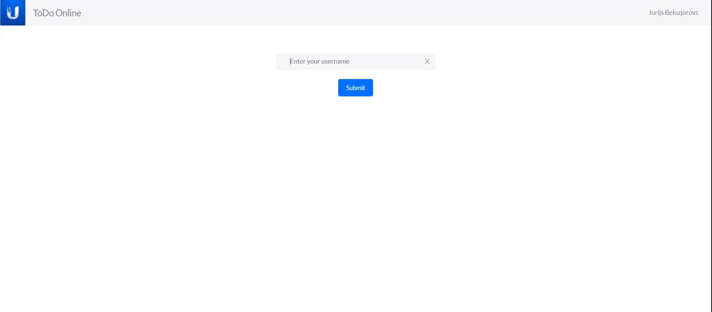

# ToDo online

## How to run the app?

Open both folders (BE and FE) in different terminals. Кun the commands 'npm install' and 'npm start' in each. Open [http://localhost:3000](http://localhost:3000) to view app in the browser. Server part is without database, so after closing BE, the changes will not be saved.

## App description

Every user can collaborate in real-time with another users. After simple log in the main page will be open, when every user can see all the users who are online and can chat with them. Every user can manage overall todo list: change status of a tasks, delete a tasks or delete a task subjects with all the tasks. User can filter tasks by status localy. User can create tasks choosing between available subjects or create new subject.
